# Vantage

**Intelligent Whiteboarding & Financial Analysis Agent**

[](https://nextjs.org/)
[](https://fastapi.tiangolo.com/)
[](https://neo4j.com/)
[](https://github.com/langchain-ai/langgraph)
[](https://www.docker.com/)
[](https://www.python.org/)
[](https://www.typescriptlang.org/)

### 🚀 View Live Demo
https://vantage-final-si2y.vercel.app/

---

## 👨‍💻 My Contribution -(Lead AI & Backend Architect)

As the **Lead AI & Backend Architect** for Team Byakugan, I designed and implemented the core intelligence layer that transforms Vantage from a simple whiteboard into an intelligent research workspace:

### 🧠 GraphRAG Pipeline Architecture
- **Architected the Neo4j Knowledge Graph pipeline** to automatically extract, store, and visualize relationships between financial entities (companies, executives, market events, competitors)
- Designed a dynamic schema that adapts to user research patterns, creating contextual connections between whiteboard nodes in real-time
- Implemented graph-based retrieval augmented generation (GraphRAG) to enable the AI to understand not just individual facts, but the interconnected web of relationships across the entire workspace

### 🤖 LangGraph Agent Orchestration
- **Engineered multi-agent research workflows using LangGraph** to coordinate specialized AI agents (Financial Analyst, Market Researcher, Company Profiler)
- Built intelligent routing logic that determines which agents to invoke based on user queries and existing graph context
- Designed the agent-to-whiteboard synchronization mechanism, allowing research findings to automatically populate as connected nodes with proper relationship edges

### 🔗 Cross-Service Communication Layer
- **Orchestrated the multi-service architecture** connecting Next.js frontend → Node.js Gateway → FastAPI AI Brain → Neo4j/MongoDB backends
- Implemented WebSocket-based real-time updates to stream agent progress and graph mutations back to the UI
- Built a unified API contract layer ensuring type-safe communication between TypeScript (Node.js) and Python (FastAPI) services
- Designed the request/response flow to handle concurrent research tasks while maintaining graph consistency

### 🎯 Technical Impact
My work enables Vantage to function as a **visual intelligence platform** where AI doesn't just answer questions—it builds and navigates a living knowledge graph of your research, revealing insights through the connections it discovers.

---

## 📸 Project Showcase

<div align="center">

### See Vantage in Action

<table>
  <tr>
    <td width="50%">
      
      <p align="center"><b>Visual Research Workspace</b><br/>AI-powered research on an infinite canvas</p>
    </td>
    <td width="50%">
      
      <p align="center"><b>Real-time Financial Analysis</b><br/>Live market data integration with NVIDIA, AAPL, GOOGL tracking</p>
    </td>
  </tr>
  <tr>
    <td width="50%">
      
      <p align="center"><b>Intelligent Features</b><br/>Create nodes, chat with AI, and perform deep research seamlessly</p>
    </td>
    <td width="50%">
      
      <p align="center"><b>Connected Knowledge Graph</b><br/>Visualize relationships between research entities and insights</p>
    </td>
  </tr>
</table>

</div>

---

## 🏗 System Architecture

```mermaid
flowchart TB
    User[👤 User] -->|Interacts| Frontend[🎨 Next.js 16 Frontend<br/>Infinite Canvas Whiteboard]
    
    Frontend -->|HTTP/WebSocket| Gateway[🚪 Node.js Gateway<br/>Express Router]
    
    Gateway -->|REST API| AIBrain[🧠 FastAPI AI Brain<br/>LangGraph Orchestration]
    
    AIBrain -->|Graph Queries| Neo4j[(🕸️ Neo4j<br/>Knowledge Graph<br/>Nodes & Relationships)]
    AIBrain -->|Vector Search| FAISS[(🔍 FAISS<br/>Semantic Embeddings)]
    AIBrain -->|User Data| MongoDB[(📦 MongoDB<br/>Sessions & Preferences)]
    
    AIBrain -->|Market Data API| YahooFinance[📈 Yahoo Finance<br/>Real-time Stock Data]
    AIBrain -->|Web Search| Tavily[🔎 Tavily Search<br/>Research Engine]
    
    Neo4j -.->|Graph Updates| Frontend
    AIBrain -.->|Agent Progress<br/>WebSocket| Gateway
    Gateway -.->|Real-time Sync| Frontend
    
    style Frontend fill:#0ea5e9,stroke:#0284c7,stroke-width:3px,color:#fff
    style Gateway fill:#8b5cf6,stroke:#7c3aed,stroke-width:3px,color:#fff
    style AIBrain fill:#f59e0b,stroke:#d97706,stroke-width:3px,color:#fff
    style Neo4j fill:#008CC1,stroke:#006A96,stroke-width:2px,color:#fff
    style FAISS fill:#10b981,stroke:#059669,stroke-width:2px,color:#fff
    style MongoDB fill:#47a248,stroke:#3d8b40,stroke-width:2px,color:#fff
    style YahooFinance fill:#720e9e,stroke:#5a0b7e,stroke-width:2px,color:#fff
    style Tavily fill:#ef4444,stroke:#dc2626,stroke-width:2px,color:#fff
```



---

## 🚀 Key Features

### 🎨 Intelligent Whiteboarding
- **Infinite canvas** with drag-and-drop node creation and connection
- Real-time collaborative editing with conflict-free state synchronization
- Custom node types: Text, Financial Data, AI Insights, Research Cards
- Automatic layout algorithms for optimal graph visualization

### 🤖 Context-Aware AI Agents
- **Multi-agent research system** powered by LangGraph with specialized roles:
  - 📊 **Financial Analyst**: Stock analysis, metrics calculation, valuation models
  - 🔍 **Market Researcher**: Competitive analysis, industry trends, news aggregation
  - 🏢 **Company Profiler**: Executive backgrounds, business model analysis, strategic positioning
- Agents understand the **full context** of your whiteboard—all connected nodes, relationships, and previous research
- Intelligent query routing based on node connections and semantic similarity

### 📈 Real-Time Financial Data Integration
- Live stock quotes, historical data, and technical indicators via Yahoo Finance API
- **Automatic entity extraction** from natural language queries ("How is Apple performing?")
- Financial metrics embedded directly into whiteboard nodes with visual sparklines
- Market event detection and automatic relationship creation (earnings reports, acquisitions, etc.)

### 🕸️ Dynamic Knowledge Graphs
- **Automatic entity recognition** and relationship extraction from research content
- Graph-based reasoning: AI traverses connections to find non-obvious insights
- Visual graph explorer with interactive filtering and multi-hop relationship queries
- Export to Neo4j Browser for advanced graph analytics

---

## 🛠 Tech Stack

### 🎨 Frontend
- **Next.js 16** (App Router) - React 19 with Server Components
- **Tailwind CSS v4** - Utility-first styling with custom design system
- **React Flow** - Canvas rendering and node management
- **ShadcN UI** - Accessible component primitives
- **TanStack Query** - Data fetching and cache management

### ⚙️ Backend Gateway
- **Node.js 20+** with **Express.js** - API routing and WebSocket handling
- **TypeScript** - Type-safe service communication
- **Socket.io** - Real-time bidirectional updates

### 🧠 AI & Logic Layer
- **Python 3.10+** - Core AI runtime
- **FastAPI** - High-performance async API framework
- **LangGraph** - Agentic workflow orchestration with cycles and state management
- **LangChain** - LLM abstraction, prompt templates, and tool integration
- **Anthropic Claude Sonnet** - Primary reasoning model for agent decisions

### 💾 Database & Storage
- **Neo4j 5.0+** - Graph database for knowledge relationships and entity storage
- **MongoDB Atlas** - Document storage for user sessions, preferences, and whiteboard snapshots
- **FAISS** - In-memory vector store for semantic similarity search
- **Redis** (optional) - Caching layer for frequent API calls

### 🌐 External Services
- **Yahoo Finance API** - Market data and historical stock information
- **Tavily API** - Web search and content extraction for research agents

---

## ⚡ Quick Start

### Prerequisites
- **Node.js 20+** and **npm/yarn**
- **Python 3.10+** and **pip**
- **Docker & Docker Compose** (recommended)
- **Neo4j Database** (local or cloud instance)
- **MongoDB** (local or Atlas)

### 1️⃣ Clone the Repository

```bash
git clone https://github.com/team-byakugan/vantage.git
cd vantage
```

### 2️⃣ Environment Configuration

Create `.env` files for each service:

**Frontend (`.env.local` in `/frontend`):**
```bash
NEXT_PUBLIC_GATEWAY_URL=http://localhost:4000
NEXT_PUBLIC_WS_URL=ws://localhost:4000
```

**Gateway (`.env` in `/gateway`):**
```bash
PORT=4000
AI_BRAIN_URL=http://localhost:8000
MONGODB_URI=mongodb://localhost:27017/vantage
JWT_SECRET=your-secret-key
```

**AI Brain (`.env` in `/ai-brain`):**
```bash
# LLM Configuration
ANTHROPIC_API_KEY=your-anthropic-key

# Database
NEO4J_URI=bolt://localhost:7687
NEO4J_USER=neo4j
NEO4J_PASSWORD=your-neo4j-password
MONGODB_URI=mongodb://localhost:27017/vantage

# External APIs
TAVILY_API_KEY=your-tavily-key
YAHOO_FINANCE_ENABLED=true

# Service Config
PORT=8000
ENVIRONMENT=development
```

### 3️⃣ Run with Docker (Recommended)

```bash
# Start all services (Frontend, Gateway, AI Brain, Neo4j, MongoDB)
docker-compose up --build

# Access the application
# Frontend: http://localhost:3000
# Gateway: http://localhost:4000
# AI Brain: http://localhost:8000/docs
# Neo4j Browser: http://localhost:7474
```

### 4️⃣ Run Locally (Development)

**Terminal 1 - Frontend:**
```bash
cd frontend
npm install
npm run dev
# Runs on http://localhost:3000
```

**Terminal 2 - Gateway:**
```bash
cd gateway
npm install
npm run dev
# Runs on http://localhost:4000
```

**Terminal 3 - AI Brain:**
```bash
cd ai-brain
python -m venv venv
source venv/bin/activate  # Windows: venv\Scripts\activate
pip install -r requirements.txt
uvicorn main:app --reload --port 8000
# Runs on http://localhost:8000
```

**Terminal 4 - Databases:**
```bash
# Start Neo4j (Docker)
docker run -p 7474:7474 -p 7687:7687 \
  -e NEO4J_AUTH=neo4j/your-password \
  neo4j:5.0

# Start MongoDB (Docker)
docker run -p 27017:27017 mongo:latest
```

### 5️⃣ Initialize the Neo4j Schema

```bash
cd ai-brain
python scripts/init_graph_schema.py
```

---

## 📚 API Documentation

Once the services are running:

- **AI Brain Swagger Docs**: http://localhost:8000/docs
- **Gateway API**: http://localhost:4000/api/health

---

## 🏆 Hackathon Achievements

**Team Byakugan** - Built in 12 hours

- ✅ Fully functional GraphRAG pipeline with Neo4j
- ✅ Multi-agent orchestration using LangGraph
- ✅ Real-time collaborative whiteboard
- ✅ Production-ready microservices architecture
- ✅ Live financial data integration

---

## 📄 License

MIT License - See [LICENSE](LICENSE) for details

---

## 👥 Team

**Team Byakugan**

- **Harshit Negi** – Lead AI & Backend Architect (Neo4j, LangGraph, FastAPI)
- **Pranshu Bansal** – Lead Frontend & Integration Engineer (Next.js, Canvas API)

---

<div align="center">

**Built with ❤️ by Team Byakugan**

[Report Bug](https://github.com/team-byakugan/vantage/issues) • [Documentation](https://github.com/team-byakugan/vantage/wiki)

</div>
